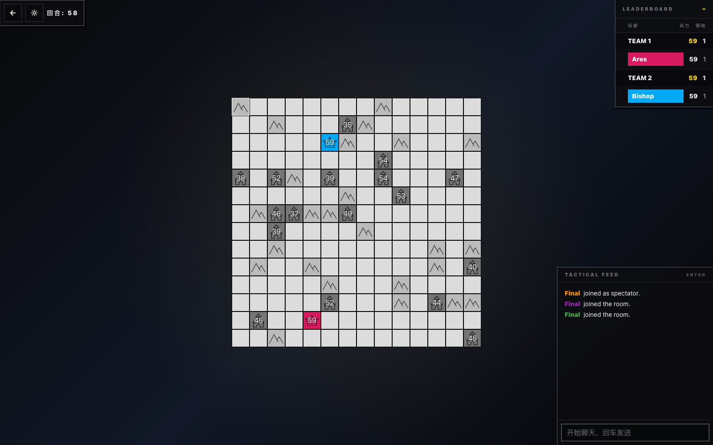
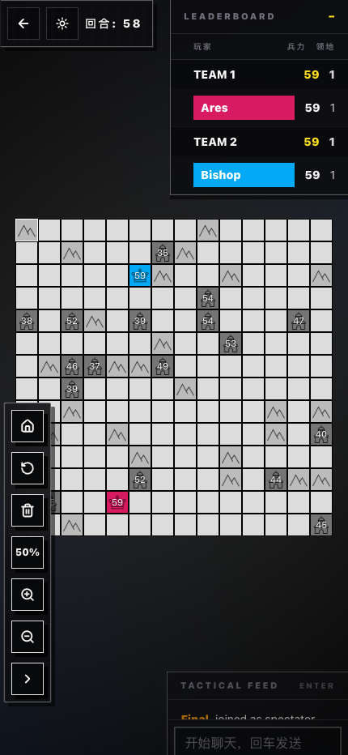

# BlockWar

<h1 align="center">
  
  <br>
  <strong>BlockWar / 方块战争</strong>
</h1>

<p align="center">
  <a href="README.zh-CN.md">简体中文</a>
</p>

> A real-time multiplayer strategy game inspired by generals.io, rebuilt as a
> Cloudflare-native full-stack app.

<p align="center">
  
  <br>
  <strong>Desktop demo</strong>
</p>

<p align="center">
  
  <br>
  <strong>Mobile demo</strong>
</p>

## Features

- Real-time multiplayer rooms with native WebSocket transport.
- Lobby, room creation, host transfer, teams, spectators, ready/force-start flow, on-demand bots, and room chat.
- Beginner tutorial flow that jumps straight into a 1v2 bot practice room with step-by-step in-game guidance.
- Classic generals.io-style gameplay with fog of war, generals/kings, cities, mountains, swamps, queued moves, surrender, and leaderboard updates.
- Optional Warring States mode, reveal-king mode, death spectator mode, map size/terrain controls, and variable game speed.
- Custom map editor, map publishing, map browsing, search, views, stars, and map ordering by new/hot/best.
- Replay persistence and replay playback after games.
- English and Chinese UI, plus dark/light theme support.
- Single Cloudflare Worker deployment for the React SPA, HTTP API, Durable Objects, WebSockets, static assets, and D1 persistence.

## Architecture

- **Frontend:** React 18, Vite, React Router, Tailwind CSS 4, i18next, and a small Next.js compatibility layer for migrated pages/components.
- **Worker API:** Hono routes under `/api`, served by Cloudflare Workers.
- **Realtime rooms:** `RoomDurableObject` manages room state, WebSocket connections, game ticks, player actions, and replay capture.
- **App coordinator:** `AppDurableObject` centralizes room summaries and persistence operations.
- **Persistence:** Cloudflare D1 stores rooms, custom maps, stars, and replay records. Tables are initialized at runtime by `AppDurableObject`.
- **Shared game logic:** Core game types and engine code live in `src/shared/game/`.
- **Assets:** Vite builds the SPA into `dist/client`; Wrangler serves it through the `ASSETS` binding with SPA fallback routing.

## Recent Stability Improvements

- Shared move validation now rejects non-cardinal moves centrally in `GameMap.commendable()`, which closes the gap for bots and any future callers.
- `MapDiff` no longer relies on `flat()` plus `JSON.stringify()` on every tick; it now compares tile tuples directly.
- Room ticks compute the leaderboard once and reuse it for per-player updates and replay capture.
- Host reassignment and post-game lobby sync now avoid resetting the host because of unrelated disconnects and skip disconnected humans/bots when selecting a replacement host.
- Mobile drag interactions now tolerate stray diagonal/skipped swipes better and clear gesture state on pinch start, `touchcancel`, and pointer exit.
- High-frequency room debug logs are suppressed in production builds to reduce console noise.

## App Routes

| Route | Purpose |
| --- | --- |
| `/` | Login, lobby, ping status, active room list, and room creation. |
| `/rooms/:roomId` | Real-time game room. |
| `/mapcreator` | Custom map editor and publishing flow. |
| `/maps/:mapId` | Custom map viewer/editor entry. |
| `/replays/:replayId` | Replay viewer. |

## API Overview

| Endpoint | Purpose |
| --- | --- |
| `GET /api/ping` | Health check used by the client. |
| `GET /api/get_rooms` | List active rooms currently stored by the app coordinator. |
| `GET /api/create_room?name=...&creator=...&preset=warring_state` | Create a room and return its room id. Supported presets are `standard`, `warring_state`, and `tutorial`; if `name` is omitted, the API falls back to `【creator】的房间`. |
| `GET /api/get_replay/:replayId` | Load a saved replay. |
| `GET /api/maps` / `POST /api/maps` | List or create custom maps. |
| `GET /api/maps/:id` / `PUT /api/maps/:id` / `DELETE /api/maps/:id` | Read, update, or delete a custom map. |
| `GET /api/new` / `GET /api/hot` / `GET /api/best` | List maps by creation time, views, or stars. |
| `GET /api/search?q=...` | Search maps by name or id. |
| `POST /api/toggleStar` | Star or unstar a map for a user id. |
| `GET /api/starredMaps?userId=...` | List map ids starred by a user. |
| `GET /ws/rooms/:roomId` | WebSocket endpoint used by the socket.io compatibility shim. |

## Local Development

Use Node.js 20 and pnpm 10 to match CI.

```bash
pnpm install
pnpm types
pnpm dev
```

`pnpm dev` runs two processes:

- `pnpm dev:assets` watches and builds the Vite SPA into `dist/client`.
- `pnpm dev:worker` starts Wrangler with the Worker, D1, Durable Objects, WebSockets, and static assets.

The client talks to the Worker through `/api` by default. Vite defines
`process.env.NEXT_PUBLIC_SERVER_API` as `/api` for the migrated client code.

## Scripts

```bash
pnpm dev             # Build client assets in watch mode and run wrangler dev
pnpm build           # Build the client and run TypeScript checks
pnpm build:client    # Build only the Vite client
pnpm typecheck       # Run tsc --noEmit
pnpm test            # Run Vitest with the Cloudflare Workers pool
pnpm check           # Build client, typecheck, and run tests
pnpm types           # Regenerate worker-configuration.d.ts from Wrangler bindings
pnpm deploy:dry-run  # Build client and validate Worker packaging
pnpm deploy          # Build client and deploy to Cloudflare Workers
```

## Project Structure

```text
├── client/              # React pages, components, hooks, context, styles, locales, assets
├── src/app/             # Vite SPA entry and React Router route table
├── src/compat/          # Next.js and socket.io compatibility shims
├── src/shared/game/     # Shared game engine, map, player, replay, and room types
├── src/worker/          # Hono Worker, Durable Objects, persistence, WebSocket room logic
├── test/                # Vitest tests for API and Durable Object behavior
├── wrangler.jsonc       # Cloudflare Worker, assets, D1, Durable Object, and route config
└── worker-configuration.d.ts
```

## Cloudflare Deployment

```bash
pnpm deploy
```

Before deploying:

- Log in with Wrangler and make sure the account can deploy Workers, Durable Objects, D1, and Workers Assets.
- Review `wrangler.jsonc`; this repository is currently configured for `blockwar.01mvp.com` and the `blockwar-db` D1 database.
- If you fork the project, update the route, zone, D1 database binding/id, and any account-specific settings.
- Run `pnpm types` after changing bindings or Wrangler configuration.
- Do not edit `worker-configuration.d.ts` by hand.

## Testing Notes

- API behavior is covered through `SELF.fetch(...)`.
- Durable Object behavior is covered through the Cloudflare Workers Vitest pool and `runInDurableObject(...)`.
- Room/WebSocket coverage currently includes joining players, forcing game start, receiving `game_started`, and advancing turns.
- Recent regression coverage also checks bot king defense legality, host transfer persistence after disconnects, mobile leaderboard defaults, and touch-specific tutorial guidance.

## Contributing

- Keep TypeScript strict and follow the existing style: 2-space indentation, single quotes, and semicolons.
- Use `PascalCase` for React components/context files, `useXxx` for hooks, and kebab-case for utility modules.
- Prefer aliases already configured in Vite/TypeScript: `@`, `@shared`, and `@worker`.
- Run `pnpm check` before opening a pull request.
- Use Conventional Commit subjects such as `feat:`, `fix:`, and `chore:`.
- Include screenshots for visible UI changes and call out changes to `wrangler.jsonc`, Durable Object bindings, D1 schema, routes, or deployment behavior.

## License

This project is licensed under the GNU General Public License v3.0. See
`LICENSE` for details.
